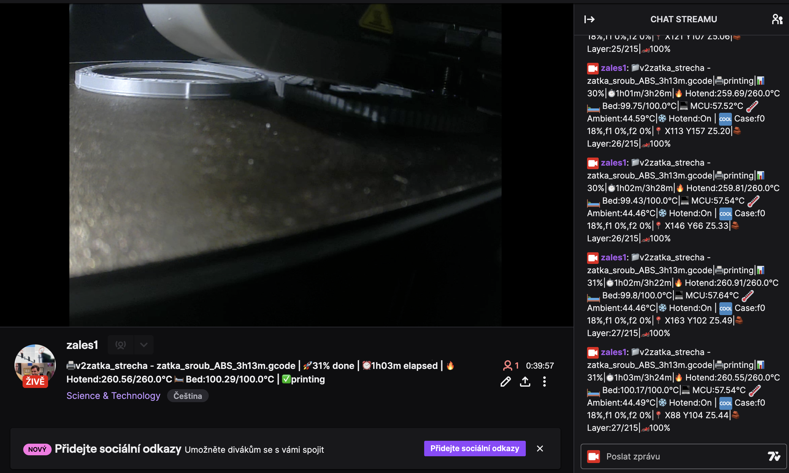

# print2twitch.py

**Stream Creality K1 webcam to Twitch, post Klipper status to chat, and update stream title**



This script runs on your Creality K1 printer (as root) to:

1. Stream the webcam feed to Twitch via FFmpeg.  
2. Periodically post detailed Klipper/Moonraker status messages into your Twitch chat.  
3. Periodically update your Twitch stream title with a concise, creative summary of the print status.  

---

## Requirements

- Python 3.6+ (system default on Creality K1)  
- FFmpeg installed and in your `PATH`  
- **requests** Python library  

```bash
# On the printer (as root):
pip3 install requests
```

---

## Installation
	1.	Copy the script into /usr/local/bin/print2twitch.py (or a location of your choice).
	2.	Make the script executable:

chmod +x /usr/local/bin/print2twitch.py


	3.	Ensure FFmpeg can access your webcam (e.g. /dev/video0 or /dev/video5).

---
## Configuration

Create a configuration file at ~/.printer_status/config.json with the following structure:

```json
{
  "client_id":         "<Your Twitch Client ID>",
  "client_secret":     "<Your Twitch Client Secret>",
  "access_token":      "<OAuth Access Token (without oauth: prefix)>",
  "refresh_token":     "<OAuth Refresh Token>",
  "broadcaster_login": "<Your Twitch Username>",

  "klipper_api_url":   "http://<printer-ip>:7125/printer/objects/query",

  "update_interval":   60,
  "chat_interval":     30,
  "title_interval":    30,

  "ffmpeg": {
    "format":        "v4l2",
    "video_size":    "640x480",
    "input_format":  "h264",
    "device":        "/dev/video5",
    "stream_key":    "live_<your-stream-key>",
    "stats_period":  30
  }
}
```

* client_id / client_secret: from your Twitch Developer application.
* access_token / refresh_token: obtained via OAuth authorization flow.
* broadcaster_login: your Twitch channel name (e.g. mychannel).
* klipper_api_url: Moonraker API endpoint on the printer.
* update_interval: fallback interval (in seconds).
* chat_interval: how often to post full status to chat.
* title_interval: how often to update the stream title.
* ffmpeg.device: video device on K1 (check with ls /dev/video*).
* ffmpeg.stream_key: the key part from your Twitch RTMP URL.
* ffmpeg.stats_period: FFmpeg status logging interval (fixed at 30s).

---
## Usage

Run the script as root (so FFmpeg can access the video device and network ports):

sudo /usr/local/bin/print2twitch.py

The script will:
* Launch FFmpeg to stream your camera.
* Spawn two background threads:
* chat_worker: posts Klipper status to chat every chat_interval seconds.
* title_worker: updates your Twitch stream title every title_interval seconds.
* Automatically refresh the Twitch OAuth access token when it expires.

---
## Troubleshooting
* Permission denied on /dev/video*: ensure you’re running as root (or add your user to the video group).
* Token refresh failures: double-check client_id, client_secret, and refresh_token in the config.
* FFmpeg errors: inspect the console output; ensure the device path and input format are correct.

